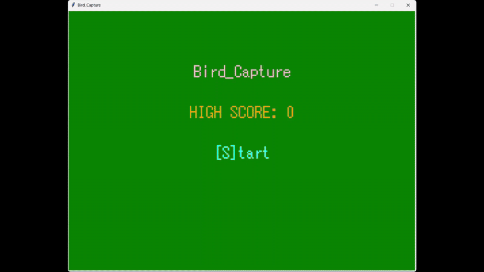

# Bird_Capture

Tkinter を使って制作した、シンプルなバードキャッチゲームです。  
Visual Studio Code 上で Python を使って開発しました。

---

## ゲーム内容

- ランダムに出現する鳥を、1〜5キーで捕獲してスコアを稼ぐゲームです。
- 鳩・雀・カラスの3種類が登場。
- 時間制限内により高得点を目指します。
- ハイスコアは `score.txt` に自動保存されます。

---

## プレイ動画（GIF）

ゲームのデモGIFです。

> ※ 尺の都合により、中盤部分をカットしたGIFを掲載しています。

---

## 使用技術・構成

- 言語：Python 3.x
- GUI：Tkinter
- 開発環境：Visual Studio Code（VSCode）

---

## 参考文献

- 廣瀬豪. Pythonではじめるゲーム制作超入門　知識ゼロからのプログラミング＆アルゴリズムと数学,インプレス,2024.

